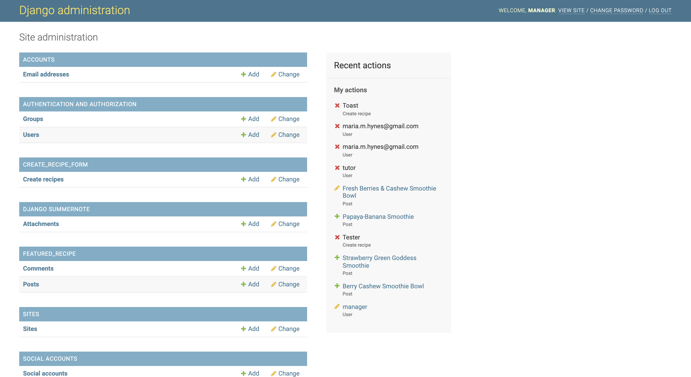

<h1 align="center">The Smoothie Hub</h1>


---

[Live Website](https://thesmoothiehub.herokuapp.com/)

[Github Repository](https://github.com/conorwalsh1/the-smoothie-hub)

---

# About

Welcome to 'The Smoothie Hub', a site where users can come together to view new recipies, share their own creations and comment on their favourite smoothie recipes. The site allows users to sign up for a free account. Once they have signed up and logged in, they will be able to create a recipe which will then be submitted to the site owner. These submissions will be made available in the 'Your Submitted Recipes' window where only the user who submitted can view, edit or delete their own submissions.

If the site owner likes a submission, they will go ahead and format the recipe to their liking and the smoothie recipe will be featured in the 'Featured Recipes' page. Unauthorised and authorised site users will be able to view the 'Featured Recipe' section, but only authorised users will be able to leave likes and comments under the recipes.

This website was built using a Macbook Pro 13". 

## User Experience (UX)

-   ### User stories

    -   #### As a User
        - I want to edit and delete my submitted smoothie recipes.

        - I want to move between the different links on the navbar.

        - I want to comment under recipes.

        - I want to like my favourite recipes.

        - I want to visit the contact page.

        - I want to visit the about page.

        - I want to create my own account.

        - I want to view smoothie recipes.

    -   #### As a Site Owner
        - I want to choose which submitted recipes get selected for the 'Featured Recipes' tab.

        - I want to create a form for recipe submissions.

        - I want to ensure that the login/logout feature works correctly.

        - I want to ensure only logged in users can submit, edit and delete their own recipes.

        - I want to validate comments made under 'Featured Recipes'.

        - I want to display messages to let users know an action has been completed.

        - I want to moderate the formatting of the site to ensure consistency of output.

    I planned my project [here](https://github.com/conorwalsh1/the-smoothie-hub/projects/1).


-   ### Design
    -   #### Colour Scheme
        -   I decided to go for a minimalist approach with the colour scheme on this project. The pictures that appear throughout the site are vibrant and bold, so as a backdrop, I went with a light grey (RAL 9003) to allow the pictures to pop against it. The text throughout the site is plain black (RAL 9005) as it contrasts well with the light grey. I only use white text in some of the buttons where a transition effect changes the button colour from the normal RAL 9003 to RAL 6038 which is a shade of green dark enough that black text is harder to read so white textworks better.
    -   #### Typography
        -   The 'Shadows Into Light' font is used to create the brand title for 'The Smoothie Hub' in the navbar. I also used 'Shadows Into Light' for custom buttons throughout the site and also in the recipe titles in the 'Featured Recipes' window. It is a casual looking font that resembles handwriting. I felt it was legible and worked well with the health and wellness theme of the site. I chose 'Open Sans Condensed' to be used for the navbar items and throughout the body of the HTML files also as I felt it complimented the 'Shadows Into Light' font but I felt that it also worked well as a clear and legible font on its own.
    -   #### Imagery
        -   I used landscape oriented images for this site. It keeps the cards looking tidy in the 'Featured Recipes' window and when you open a recipe, the picture doens't tend to dominate the screen when it is not vertically overbearing.

*   ### Wireframes

    -   I chose to use Balsamiq Wireframes to plan out how I wanted the site to look. The pictures posted below show how I wanted the Home page, the Featured Recipes page, the About page, the Contact Page, the Your Submitted Recipes page and the Submit A New Recipe to appear.

    <br>

    <h2 align="center">Home</h2>

    <br>

    

    <br>

    <h2 align="center">Featured Recipes</h2>

    <br>

    

    <br>

    <h2 align="center">About</h2>

    <br>

    

    <br>

    <h2 align="center">Contact Us</h2>

    <br>

    

    <br>

    <h2 align="center">Your Submitted Recipes - Logged Out</h2>

    <br>

    

    <br>

    <h2 align="center">Your Submitted Recipes - Logged In</h2>

    <br>

    

    <br>

    <h2 align="center"> Submit A New Recipe</h2>

    <br>

    

    <br>

    
# Features

## Navbar

<br>


<br>

- The navbar is available at the top of the page for the site user at all times. It contains a brand title written in 'Shadows Into Light' font. It also has links to each relevant page on the site. When the user is logged out, they will see a 'Login' link. Depending on whether they are a normal site user or a site manager, new options will appear to them once they have logged in

<br>


<br>

- When a site user logs in, a new link will appear which will allow them to submit a recipe to be considered by the site owner. They will also be able to see a welcome message with their name also being displayed.

<br>


<br>

- On smaller screen sizes, the navbar will change from being displayed horizontally to being displayed vertically. This makes the site more user friendly. The user can simply click on the burger icon and the navbar will be displayed. We can also see in the picture above that a manager has logged in. As the manager is a superuser, a new link 'Admin' has appeared. We will explore this further on in 'Features'.

<br>

## Featured Recipes

<br>


<br>

- The 'Featured Recipes' page is where the site owner can display the best recipes of his/her choosing. Once users submit a recipe via the "Submit A New Recipe" form, the details of their submission will appear in the Django admin panel. Recipes displayed in this section contain a title, an author, the date and time of upload, ingredients, method, with comments and likes underneath posts. The ability to like and comment is only available to authorised site users. Comments will be sent to the Django admin panel where the site owner will have to validate that the comments are appropriate before they appear to other users.

<br>

## About

<br>


<br>

- The 'About' section is a designated area where site users can figure out what 'The Smoothie Hub' is all about. It explains why the site was set up, how a site user can get involved with their own account, how they can get in contact with either the recipe author or even the site owner. There are relevant links in the paragraph element to steer users in the right direction.

<br>

## Contact Us

<br>


<br>

- The 'Contact Us' page shows site users how they can get in contact with the site owners directly. It shows them in what town the site was founded. It also shows them the relevant phone number which they can call and it also has an email address linked. By clicking on the email hyperlink, a new tab will open where the user will find that the 'To:' field has been prepopulated with email belonging to the 'The Smoothie Hub'

<br>

## Your Submitted Recipes

<br>


<br>

- The 'Your Submitted Recipes' page is displayed in two different ways, depending on whether the site user is logged in or not. If the user is not logged in, they will be shown the prompt above encouraging them to log in to view their submitted recipes with an appropriate hyperlink.

<br>

<br>


<br>

- However, if the user is logged in, the 'Your Submitted Recipes' page will show a table which displays the users submitted recipes. This page only shows the users their own recipes, hiding others submissions from them. The table will have the column headings 'Title', 'Ingredients', 'Method' with a row beneath for each individual recipe submission. In the fourth or fifth column, the user will find a button where they can edit and delete recipes respectively. The effects of using these buttons will automatically be shown to the user, following inline with CRUD.

## Submit A New Recipe

<br>


<br>

- The 'Submit A New Recipe' link, whether it is clicked from the navbar or clicked at the bottom of the 'Your Submitted Recipes' upon successful login will bring users to a form. The inputs for this form are labelled 'Title', 'Ingredients', 'Method'. Upon clicking the 'Submit Recipe' button, the data will be sent to the database for the site owner to consider if it worthy of making the 'Featured Recipes' page, but it will also be sent to the 'Your Submitted Recipes' as we mentioned above where the user can then view, edit or delete.

<br>


<br>

- I also implemented validation, whereby the user will not be able to submit a new recipe which has blank fields.

<br>

## Admin

<br>



<br>

- Once the superuser has logged into the site, they will have access to the Django admin panel via the link mentioned above in the Navbar section. From here, they will be able to handle all data sent by the user via the 'Submit A New Recipe' form and they will be able to wield this data. From the list of submitted recipes, they can choose which ones they wish to display in the 'Featured Recipes' page. In the picture above, the 'CREATE_RECIPE_FORM' section is where all recipes submitted via the 'Submit A New Recipe' form appear. Let's take a closer look at this section in the image below.

<br>


<br>

- Here, we can see three different recipes submitted by three different users. Notice how some users did not use capital letters in all the words of their recipe title. This just would not look good if it was to be published straight to the site. However, the site owner can see this, acknowledge that the recipe is indeed delicious and worthy of the "Featured Recipes" page and can style the recipe to his/her liking. I implemented Summernote to allow the site owner the adequate tools to format the recipes to their liking. In the image below, we can see that upon submission, the site user submitted the recipe without any real structure. The site owner can now copy this submitted information from the 'CREATE_RECIPE_FORM' section and bring it down to the 'FEATURED RECIPES' section which I will show below the two images images.

<br>


<br>

<br>


<br>

- Above, we can see the two forms that Marys submission takes. The first is her own submission that appeared in the 'CREATE_RECIPE_FORM' section. Now that we are in the 'FEATURED RECIPES' section, we can edit the post using summernote, making sure the font style and size is consistent. We can use an unordered list for the ingredits and then an ordered list for the method. Once this page is saved and set to publish, we can go back to our site where we can see Marys post has been uploaded with a picture, and other registered members of 'The Smoothie Hub' community can like and comment on the recipe post.

<br>

## Features To Add In The Future

-   Ability for site owner to edit and validate recipes from the site as opposed to Django admin

-   Ability for recipe authors to reply to comments under their recipe postings.

-   Different categories for smoothies with a 'Sort By:' button so users and owner can sort recipes based on whether smoothies are healthy, sweet etc.

- A contact form on site where users can contact owners directly.

- A little icon which shows that recipe submission is pending approval from site owner which transforms into a tick mark if submission has been accepted.

- A blog for the site.

- A forum where users can ask general questions to the community of 'The Smoothie Hub'

## Technologies Used

### Languages Used

-   [HTML5](https://en.wikipedia.org/wiki/HTML5)
-   [CSS3](https://en.wikipedia.org/wiki/Cascading_Style_Sheets)
-   [Python](https://en.wikipedia.org/wiki/Python_(programming_language))

### Frameworks, Libraries & Programs Used

1. [Google Fonts:](https://fonts.google.com/)
    - Google fonts was used to import the 'Shadows Into Light' and 'Open Sans Condensed' fonts into the style.css file which is used throughout the project.
2. [Balsamiq:](https://fontawesome.com/)
    - Balsamiq was used to draft up the wireframes for the project which helped me visualise what I wanted to achieve.
3. [Git](https://git-scm.com/)
    - Git was used for version control by utilizing the Gitpod terminal to commit to Git and Push to GitHub.
4. [GitHub:](https://github.com/)
    - GitHub is used to store the projects code after being pushed from Git.
5. [Responsive Design:](http://ami.responsivedesign.is/)
    - Responsive design was used to create responsive design imitator image.
6. [Chrome DevTools:](https://developer.chrome.com/docs/devtools/)
    - Used to test code throughout the project by using the console and by trying out different variations of code before settling on any type and implementing it into the project.
7. [Bootstrap:](https://getbootstrap.com/)
    - Used to get code blocks for HTML.
8. [Django:](https://www.djangoproject.com/)
9. [Postgres:](https://www.postgresql.org/)
10. [Heroku:](https://.heroku.com/)
11. [Favicon:](https://favicon.io/)
12. [W3C Markup Validator](https://validator.w3.org/)
13. [W3C CSS Validator](https://jigsaw.w3.org/css-validator/)
14. [PEP8](http://pep8online.com/)

## Code Validation

The W3C Markup Validator, W3C CSS Validator, and PEP8 were used to validate every page of the project to ensure there were no syntax errors in the project.
    <h2 align="center">HTML Validator Results</h2>
-   [W3C Markup Validator](https://validator.w3.org/#validate_by_input) 
    
    <h2 align="center">CSS Validator Results</h2>
-   [W3C CSS Validator](https://res.cloudinary.com/df43mitr9/raw/upload/v1/static/css/style.9b6ff134680e.css)
    
    <h2 align="center">PEP8 Online</h2>    
-   [PEP8](http://pep8online.com/)
    
    

## Testing

1. As a user, I want to easily determine what kind of website it is.
    - Result: TEST PASSED
2. As a user, I want to see what recipes are displayed on the 'Featured Recipes' page.
    - Result: TEST PASSED
3. As a user, I want to see how many likes a featured recipe has.
    - Result: TEST PASSED
4. As a user, I want to see how many comments a featured recipe has.
    - Result: TEST PASSED
5. As a user, I want to sign up for an account.
    - Result: TEST PASSED
6. As a user, I want to log into my account.
    - Result: TEST PASSED
7. As a user, I want to log out of my account.
    - Result: TEST PASSED
8. As a user, I want to see the site owners contact information.
    - Result: TEST PASSED
9. As a user, I want to submit a new recipe.
    - Result: TEST PASSED
10. As a user, I want to edit a previously added recipe.
    - Result: TEST PASSED
11. As a user, I want to delete a previously added recipe.
    - Result: TEST PASSED
12. As a user, I want to comment under a featured recipe.
    - Result: TEST PASSED
13. As a user, I want to like a featured recipe.
    - Result: TEST PASSED

### Further Testing

-   The Website was tested on Google Chrome, Internet Explorer, and Safari browsers.
-   The website was viewed on a variety of devices such as Desktop, Laptop, Samsung 4K Television, iPad, iPhone 7 (Regular and Plus), & iPhoneX.
-   Friends and family members were asked to review the site and documentation to point out any bugs and/or user experience issues.

### Known Bugs

-   There are no known bugs at this time.

## Deployment

### GitHub Pages

The project was deployed to GitHub Pages using the following steps...

1. Log in to GitHub and locate the [GitHub Repository](https://github.com/)
2. At the top of the Repository (not top of page), locate the "Settings" Button on the menu.
    - Alternatively Click [Here](https://raw.githubusercontent.com/) for a GIF demonstrating the process starting from Step 2.
3. Scroll down the Settings page until you locate the "GitHub Pages" Section.
4. Under "Source", click the dropdown called "None" and select "Master Branch".
5. The page will automatically refresh.
6. Scroll back down through the page to locate the now published site [link](https://github.com) in the "GitHub Pages" section.

### Forking the GitHub Repository

By forking the GitHub Repository we make a copy of the original repository on our GitHub account to view and/or make changes without affecting the original repository by using the following steps...

1. Log in to GitHub and locate the [GitHub Repository](https://github.com/)
2. At the top of the Repository (not top of page) just above the "Settings" Button on the menu, locate the "Fork" Button.
3. You should now have a copy of the original repository in your GitHub account.

### Making a Local Clone

1. Log in to GitHub and locate the [GitHub Repository](https://github.com/)
2. Under the repository name, click "Clone or download".
3. To clone the repository using HTTPS, under "Clone with HTTPS", copy the link.
4. Open Git Bash
5. Change the current working directory to the location where you want the cloned directory to be made.
6. Type `git clone`, and then paste the URL you copied in Step 3.

```
$ git clone https://github.com/YOUR-USERNAME/YOUR-REPOSITORY
```

7. Press Enter. Your local clone will be created.

```
$ git clone https://github.com/YOUR-USERNAME/YOUR-REPOSITORY
> Cloning into `CI-Clone`...
> remote: Counting objects: 10, done.
> remote: Compressing objects: 100% (8/8), done.
> remove: Total 10 (delta 1), reused 10 (delta 1)
> Unpacking objects: 100% (10/10), done.
```

Click [Here](https://help.github.com/en/github/creating-cloning-and-archiving-repositories/cloning-a-repository#cloning-a-repository-to-github-desktop) to retrieve pictures for some of the buttons and more detailed explanations of the above process.

## Credits

### Code

-   [Digital Ocean](https://www.digitalocean.com/community/tutorials/how-to-add-a-favicon-to-your-website-with-html) : I copied the template code on this site so that my favicon would work correctly.

-   [Stack Overflow](https://stackoverflow.com/questions/2573979/force-page-reload-with-html-anchors-html-js) : I wanted to force a page reload once the logo was clicked and I acheived this using information here.

-   [Stack Overflow](https://stackoverflow.com/questions/12194435/cannot-set-property-display-of-undefined) : I came across a bug stating "Cannot set display of undefined" in Dev tools. I followed an approach here to eradicate the issue.

-   [Stack Overflow](https://stackoverflow.com/questions/22549032/illegal-use-of-break-statement-javascript) : I was trying to use the "break" statement which I thought would end the loop generating quiz questions but it said "illegal use of break". I then researched online and found that the "return" statement was a better fit as it would break the execution flow of the function and that break was used more for 'for' or 'while' loops.

-   [Stack Overflow](https://stackoverflow.com/questions/3304014/how-to-interpolate-variables-in-strings-in-javascript-without-concatenation) : I used this resource to figure out how to interpolate the final score into the string of if statements that appear in the generateNextQuestion function.

-   [YouTube](https://www.youtube.com/watch?v=MLfAW55_4cY) : I followed the first part of this tutorial to acheive the desired effect of a hover olay for my buttons.

-   [W3Schools](https://www.w3schools.com/cssref/pr_border-style.asp) : I used this site as I was looking to remove a border style that was appearing dotted when I just wanted a simple plain border.

-   [W3Schools](https://www.w3schools.com/jsref/prop_pushbutton_disabled.asp) : I used this site as I was looking for a way to stop the correct answer button from being clicked more than once which was incrementing the score infinitely based on how many time the user clicked the same correct answer.

- My functions incrementScore and incrementIncorrectScore were taken from the 'Love Maths' Code Institute walkthrough, I replaced the Id's with my own.

### Problems Overcame

-   I found Javascript quite tough initially. When I started the project I relied heavily on a Youtube tutorial (https://www.youtube.com/watch?v=riDzcEQbX6k&t=1374s) which created a multiple choice quiz exactly how I wanted it to look but I could not explain how any of the Javascript functions worked. I spoke with my tutor Maria who advised that the Javascript code must be custom written. I deleted the project and went back to the start of the Javascript course and I went through the modules again, this time bookmarking parts I realised I could use in my own project and thereby gaining a better understanding of JS. By the time I came through the JS module, I felt much more prepared and I started writing my own custom JS. You will be able to see in the commits where I deleted the JS code and started afresh.

-   One function I had a lot of trouble with was the correctAnswer function. I spent a number of days working different angles but I was delighted to get it working in the end. What I figured out was that I was missing was the event parameter within the function itself.

-   I kept receiving an error once the quiz came to a close, saying :

    TypeError: Cannot read property 'question' of undefined
       at generateQuestion (script.js:29)
       at HTMLButtonElement.generateNextQuestion (script.js:57)

    I kept looking through the course material and found the "break" statement which I thought would end the loop. I tried but it still wouldn't work. I then researched online and found that the "return" statement was a better fit as it would break the execution flow of the function and that break was used more for 'for' or 'while' loops.

-   When the site was being tested, a user brought to my attention that the answer buttons could be clicked infinitely, which was an issue as the correct score could be incremented above ten which was how many questions and possible correct answers were present. I went about creating a function to resolve this issue by creating one function that disabled the buttons once the correct answer was clicked and another function that reactivated the buttons once the 'Next' button was clicked. I was happy to just block the user from clicking the correct answer more than once as the quiz is built for children, I want them to feel encouraged to try again to find out what the correct answer is, even if by process of elimination.


### Content

-   Code Institute README.md template.

-   All other content was written by Conor Walsh.


### Acknowledgements

-   I would like to thank my mentor Maria Hynes for guiding me along the right path throughout our mentoring sessions. There were times I struggled with getting the way I wanted the code to look out of my head and onto the screen, but she gave me great motivation to persevere and I am very grateful for her assistance. I would also like to thank the tutors that helped me along the way.


Links

https://mdbootstrap.com/docs/b4/jquery/navigation/hamburger-menu/ - nav bar

https://mdbootstrap.com/docs/standard/navigation/footer/ - Footer bootstrap

https://www.goodhousekeeping.com/food-recipes/healthy/g4060/healthy-smoothie-recipes/?slide=17 - Smoothie Images

https://www.codeblocq.com/2016/05/Blur-Image-on-Hover-with-CSS/ - Image Blur

https://www.w3schools.com/tags/tryit.asp?filename=tryhtml_button3 - Hover effect for buttons

https://joyfoodsunshine.com/wp-content/uploads/2019/07/green-smoothie-recipe-featured.jpg - default recipe image

Issues

corrupted data base, had to go into heroku and delete database

unable to migrate until (blank=True) for post class in models

bug where every post was liked by every registered site user


